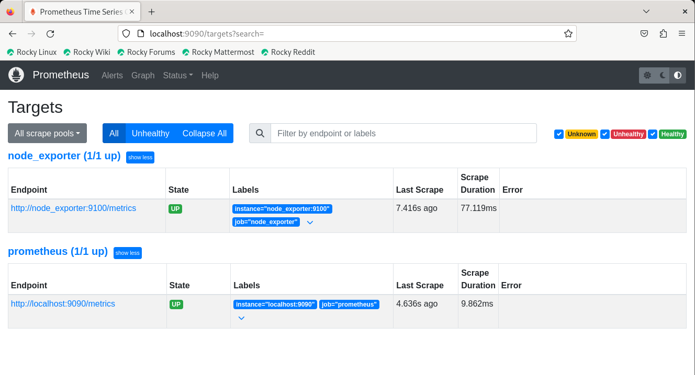

# Locally Monitoring using Docker
## Step 1: docker-compose
in this example docker-compose contains 3 containers:
```bash
docker compose up -d
```
  ### 1) node_exporter:
      1. Run a container named node-exporter
      2. Using port 9100
      3. Mount root volume from host into the container using read only permissions
      4. Exclude some sensetive directorices to exclude collecting metrcies from them
      4. Create the container from the image prom/node-exporter:latest
  ### 2) prometheus-docker:
    1. Run a container named prometheus-docker
    2. Using port 9090
    3. Set Bind mount volume to bind Prometheus configuration File into container
    4. Create the container from the image prom/prometheus
 Therefore, in this configuration, Prometheus collects data from two sources:
              
    1. Metrics exposed by itself (Prometheus server) running on localhost at port 9090.
    2. Metrics exposed by a node exporter service running at hostname 'node_exporter' on port 9100.   
  ### 3) grafana-docker:
      1.  Run a container named grafana-docker
      2.  Using port 3000
      3. Set persistent volume name to grafana_data to /var/lib/grafana
      4. Create the container from the image grafana/grafana
## Step 2: Check if containers are up and running
  ### Check Node Exporter is up and running

    http://localhost:9100

  
  ### Check prometheus is up and running

    http://localhost:9090

  
  ### Check Grafana is up and running

    http://localhost:3000

  
  ## Step 3: Connect Grafana to Pull metrics from Prometheus
   1. Navigate to:

    http://localhost:3000

   2. Login Credentials: `you can create new password or skip`
      
     username: admin
     password: admin
   3. Navigate to `Data Source` and choose `Prometheus`
   4. In the `URL` field add your `Machine IP` followed by Prometheus port `9090` to look like the following, Then `Save & Test`

     http://IP:9090
   5. Navigate to `Dashboard` then `Import` and use the dashboard id `1860` then `Load`
   6. From the last section choose `Prometheus` then `Import`  
You will be able to see all the data pulled from the node exporter presented in a nice UI

    
      
      
